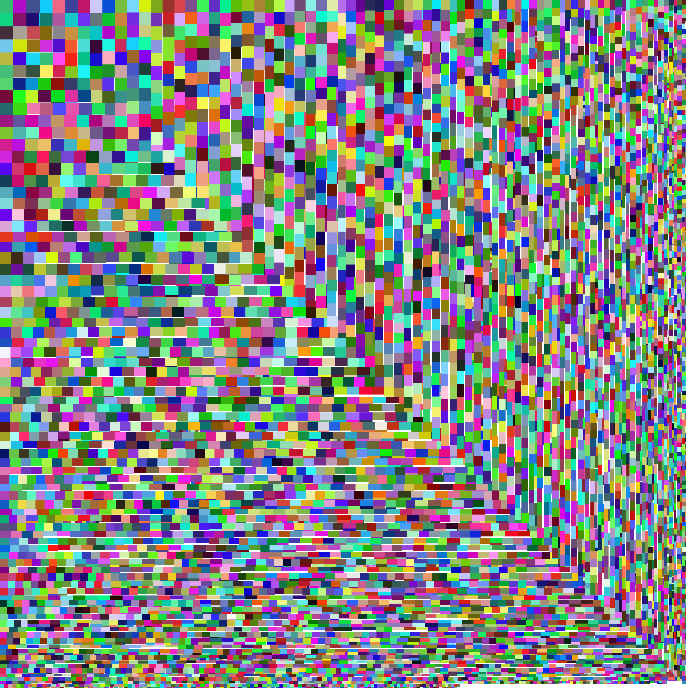
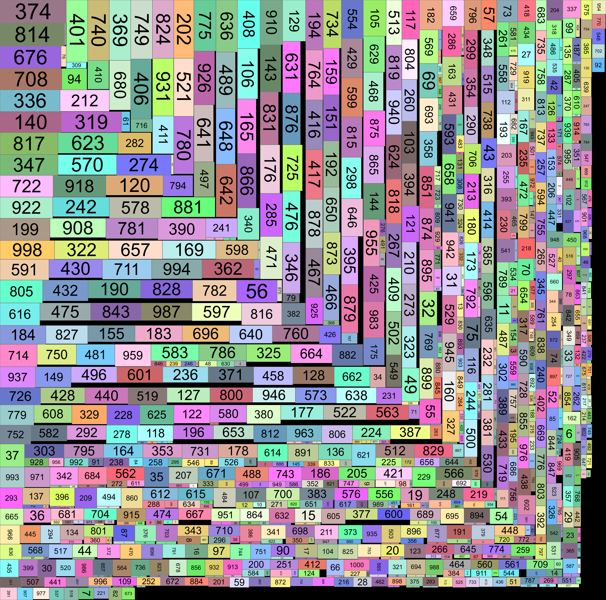

rect pack
===
## Usage
  see `src/test.ts` and `src/test2.ts`

## Result
- 10000 random rectangles(1 <= width, height <= 100)
  utilization: 25574275/26718512(95.72%)
  

- 1000 random rectangles(12 <= width, height <= 200)
  utilization: 24582270/27164215(90.50%)
  
